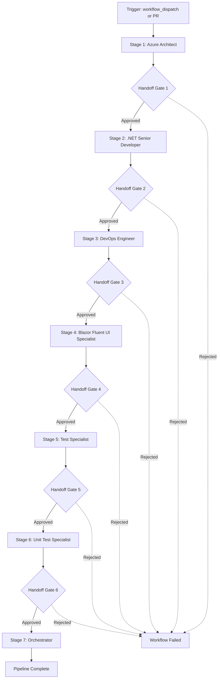

# Sequential Multi-Agent Workflow

## Overview

This directory contains a **production-ready, GitHub Actions-based sequential multi-agent workflow** for .NET codebases. The workflow implements a controlled, stage-gated pipeline where each "agent" (stage) specializes in a specific aspect of software quality assurance.

## Workflow Files

### Main Orchestrator
- **`sequential-handoff.yml`** - Orchestrates all 7 stages with approval gates

### Reusable Stage Workflows
1. **`reusable-azure-architect.yml`** - Architecture validation and structure verification
2. **`reusable-dotnet-senior-developer.yml`** - Build, code analysis, and formatting
3. **`reusable-devops-engineer.yml`** - CI/CD validation and artifact creation
4. **`reusable-blazor-fluentui-specialist.yml`** - Frontend build and validation
5. **`reusable-test-specialist.yml`** - Integration and E2E testing
6. **`reusable-unit-test-specialist.yml`** - Unit testing with coverage collection
7. **`reusable-orchestrator.yml`** - Final coordination and merge readiness

## Architecture



## Key Features

### ✅ Sequential Execution
- Each stage depends on the previous stage's successful completion
- Uses `needs:` to enforce strict ordering
- No parallel execution - truly sequential

### ✅ Manual Approval Gates
- 6 handoff points between stages
- Requires GitHub Environment configuration
- Designated reviewers must approve before proceeding

### ✅ Comprehensive Validation
Each stage performs domain-specific checks:
- **Architecture**: Manifest, structure, documentation
- **.NET Development**: Build, analyzers, formatting, dependencies
- **DevOps**: Workflow validation, script checks, artifact packaging
- **Frontend**: React/Blazor build, Fluent UI validation, linting
- **Testing**: Integration/E2E tests, unit tests with coverage
- **Orchestration**: Artifact verification, metrics, merge readiness

### ✅ Smart Detection
Workflows detect project features:
- React frontend presence
- Blazor component usage
- Integration test projects
- Unit test projects
- Fabric manifest files

### ✅ Artifact Management
Produces artifacts at each stage:
- Build outputs (7 days)
- Deployment packages (30 days)
- Frontend builds (7 days)
- Test results (7 days)
- Coverage reports (30 days)

### ✅ Performance Optimized
- NuGet package caching
- npm dependency caching
- Concurrent safe with `concurrency` control
- Reusable workflows for maintainability

## Usage

### Prerequisites
1. Merge workflow files to `main` or `develop` branch
2. (Optional) Configure GitHub Environments for approval gates
3. Ensure repository has `.sln` and `.csproj` files

### Trigger Manually
```
Actions → Sequential Multi-Agent Workflow → Run workflow
```

### Trigger on PR
```bash
git checkout -b feature/my-feature
git commit -am "My changes"
git push origin feature/my-feature
# Open PR to main/develop → workflow starts automatically
```

### Approve Handoffs
```
Workflow Run → Review pending deployments → Select environment → Approve
```

## Configuration

### Workflow Inputs
| Input | Description | Default | Required |
|-------|-------------|---------|----------|
| `dotnet-version` | .NET SDK version | `8.0.x` | No |

### Environment Variables
```yaml
env:
  DOTNET_VERSION: ${{ inputs.dotnet-version || '8.0.x' }}
```

### Concurrency
```yaml
concurrency:
  group: ${{ github.workflow }}-${{ github.ref }}
  cancel-in-progress: false
```

## Artifacts Produced

| Artifact | Stage | Description | Retention |
|----------|-------|-------------|-----------|
| `build-output` | .NET Senior Developer | Compiled binaries | 7 days |
| `deployment-package` | DevOps Engineer | Publishable artifacts | 30 days |
| `frontend-build` | Blazor Fluent UI | Built frontend | 7 days |
| `integration-test-results` | Test Specialist | Integration test TRX | 7 days |
| `unit-test-results` | Unit Test Specialist | Unit test TRX | 7 days |
| `coverage-report` | Unit Test Specialist | Coverage HTML + XML | 30 days |

## Required GitHub Environments

Create these environments in **Settings → Environments**:
1. `handoff-azure-architect`
2. `handoff-dotnet-senior`
3. `handoff-devops`
4. `handoff-blazor-fluentui`
5. `handoff-test-specialist`
6. `handoff-unit-test-specialist`

For each environment:
- Enable **Required reviewers**
- Add reviewers (users/teams)
- (Optional) Configure deployment branches

**📖 Detailed setup:** [GitHub Environments Setup Guide](../../docs/github-environments-setup.md)

## Documentation

| Document | Description |
|----------|-------------|
| [Sequential Handoff Workflow](../../docs/sequential-handoff-workflow.md) | Complete workflow documentation |
| [GitHub Environments Setup](../../docs/github-environments-setup.md) | Environment configuration guide |
| [Workflow Quick Start](../../docs/workflow-quick-start.md) | First-time user guide |

## Stage Details

### Stage 1: Azure Architect (1-2 min)
**Purpose**: Validate architecture and project structure

**Checks**:
- Repository structure (src/, tests/, docs/)
- Solution and project files
- Fabric manifest validation (if present)
- Documentation presence

**Output**: Architecture metrics and validation report

---

### Stage 2: .NET Senior Developer (2-5 min)
**Purpose**: Build solution and perform code quality analysis

**Checks**:
- NuGet package restoration
- Solution build (Release configuration)
- Code analyzers (warning level 4)
- Code formatting (dotnet format)
- Package dependency analysis

**Output**: Build artifacts, analyzer results

---

### Stage 3: DevOps Engineer (3-5 min)
**Purpose**: Validate CI/CD configuration and create deployment artifacts

**Checks**:
- GitHub Actions workflow validation
- YAML linting
- PowerShell script syntax validation
- Deployment package creation
- Artifact publishing

**Output**: Deployment package with manifests and scripts

---

### Stage 4: Blazor Fluent UI Specialist (3-8 min)
**Purpose**: Validate frontend build and UI components

**Checks**:
- Frontend technology detection
- Fluent UI dependency validation
- npm package installation
- Frontend build (React)
- Linting (if configured)
- Blazor component validation

**Output**: Frontend build artifacts

---

### Stage 5: Test Specialist (2-10 min)
**Purpose**: Execute integration and E2E tests

**Checks**:
- Integration test project detection
- E2E test project detection
- Test execution
- Results reporting
- Placeholder guidance if tests missing

**Output**: Integration test results

---

### Stage 6: Unit Test Specialist (2-5 min)
**Purpose**: Execute unit tests with coverage collection

**Checks**:
- Unit test project detection
- Test execution with Coverlet
- Coverage collection (Cobertura, OpenCover, JSON)
- Coverage report generation
- Line and branch coverage calculation

**Output**: Test results and coverage report

---

### Stage 7: Orchestrator (1-2 min)
**Purpose**: Aggregate results and verify merge readiness

**Checks**:
- Artifact presence verification
- Build artifact validation
- Test result validation
- Coverage report validation
- Merge readiness checklist (7 checks)
- Final metrics aggregation

**Output**: Comprehensive pipeline summary

---

## Typical Execution Time

**Without approvals**: 15-35 minutes
**With manual approvals**: Depends on reviewer response time

Breakdown:
- Architecture: ~1-2 min
- Build: ~2-5 min
- DevOps: ~3-5 min
- Frontend: ~3-8 min
- Integration Tests: ~2-10 min
- Unit Tests: ~2-5 min
- Orchestrator: ~1-2 min

## Customization

### Add Custom Stage

1. Create new reusable workflow: `reusable-custom-stage.yml`
2. Add stage to `sequential-handoff.yml`:
   ```yaml
   custom-stage:
     needs: previous-stage
     uses: ./.github/workflows/reusable-custom-stage.yml
   ```
3. Add handoff gate:
   ```yaml
   handoff-custom:
     needs: custom-stage
     environment: handoff-custom
   ```

### Modify .NET Version

Default is `8.0.x`. To change:
- **Workflow dispatch**: Set input when running manually
- **Hardcode**: Edit `sequential-handoff.yml`:
  ```yaml
  env:
    DOTNET_VERSION: '9.0.x'
  ```

### Skip Approval Gates

Remove or don't configure environments. Workflow runs without pausing.

### Add Notifications

See [GitHub Environments Setup Guide](../../docs/github-environments-setup.md#notifications)

## Troubleshooting

### Workflow doesn't start
- Check workflow file is on target branch
- Verify PR targets `main` or `develop`
- Ensure Actions are enabled in Settings

### Stage fails
- Click failed stage for logs
- Check error messages
- Fix locally and re-run

### Can't approve handoff
- Verify environment configuration
- Check you're added as reviewer
- Ensure write access to repository

### Artifacts missing
- Check stage completed successfully
- Verify retention period not expired
- Some artifacts are conditional

## Maintenance

### Update Dependencies
Workflow uses latest stable versions:
- `actions/checkout@v4`
- `actions/setup-dotnet@v4`
- `actions/setup-node@v4`
- `actions/cache@v4`
- `actions/upload-artifact@v4`
- `actions/download-artifact@v4`

### Lint Workflows
```bash
yamllint .github/workflows/
```

Configuration in `.yamllint` at repository root.

### Test Locally
```bash
# Validate YAML syntax
python3 -c "import yaml; yaml.safe_load(open('.github/workflows/sequential-handoff.yml'))"

# Test build
dotnet build

# Test frontend
cd src/FabricMappingService.Frontend && npm install && npm run build
```

## Security

- No secrets required for basic operation
- Runs in isolated GitHub Actions runner
- Artifacts auto-expire (7-30 days)
- Environment protection rules enforce review

## License

Same as repository license.

## Contributing

Improvements welcome! Please:
1. Test changes on a fork
2. Ensure all stages complete
3. Update documentation
4. Submit PR with description

## Support

- 📖 [Complete Documentation](../../docs/sequential-handoff-workflow.md)
- 🚀 [Quick Start Guide](../../docs/workflow-quick-start.md)
- 🔧 [Environment Setup](../../docs/github-environments-setup.md)
- 🐛 Open an issue for bugs
- 💬 Contact maintainers for questions

---

**Built for the Sequential Multi-Agent Workflow pattern**
