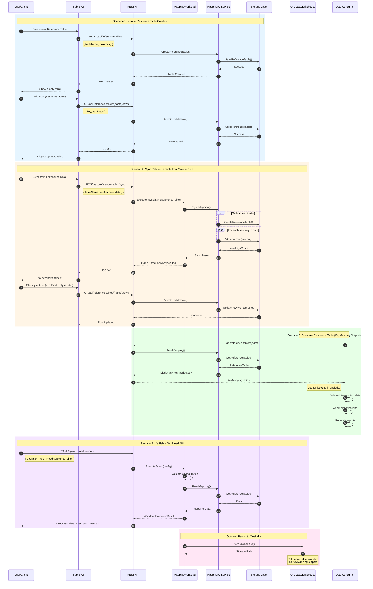

# UI Mockups - Reference Table & Lookup Tool

## Visual Guide to the Fabric Mapping Service

This document provides detailed visual mockups and diagrams to help you understand how the Reference Table (Lookup Table) solution works and what the user interface looks like.

## Table of Contents

1. [Solution Overview](#solution-overview)
2. [Reference Table Concept](#reference-table-concept)
3. [Main UI Components](#main-ui-components)
4. [User Workflows](#user-workflows)
5. [API Integration Flow](#api-integration-flow)
   - [Sequence Diagram: Lookup Table Workflow](#sequence-diagram-lookup-table-workflow)
6. [Microsoft Fabric Integration](#microsoft-fabric-integration)

---

## Solution Overview

### What is this Solution?

The Fabric Mapping Service provides **Reference Tables** (also known as **Lookup Tables** or **KeyMapping Tables**) for data classification, harmonization, and transformation in Microsoft Fabric.

```
┌────────────────────────────────────────────────────────────────────────┐
│                     Fabric Mapping Service                              │
│                                                                         │
│  ╔═══════════════════════════════════════════════════════════════╗    │
│  ║  REFERENCE TABLES (Lookup Tables / KeyMapping)                ║    │
│  ║                                                                ║    │
│  ║  Purpose: Classify, group, and harmonize data values          ║    │
│  ║                                                                ║    │
│  ║  Example Use Cases:                                            ║    │
│  ║  • Product Type Classification                                 ║    │
│  ║  • Cost Center Mapping                                         ║    │
│  ║  • Medical Diagnosis Codes                                     ║    │
│  ║  • Customer Segmentation                                       ║    │
│  ║  • Label Harmonization across Systems                          ║    │
│  ╚═══════════════════════════════════════════════════════════════╝    │
│                                                                         │
│  ╔═══════════════════════════════════════════════════════════════╗    │
│  ║  ATTRIBUTE-BASED MAPPING (Additional Feature)                 ║    │
│  ║                                                                ║    │
│  ║  Purpose: Transform data between different schemas            ║    │
│  ║  • Legacy System Modernization                                 ║    │
│  ║  • API Integration                                             ║    │
│  ║  • ETL Processes                                               ║    │
│  ╚═══════════════════════════════════════════════════════════════╝    │
└────────────────────────────────────────────────────────────────────────┘
```

---

## Reference Table Concept

### What is a Reference Table?

A Reference Table is a **lookup table** that helps you classify, group, and standardize data values. Think of it as a master list that defines how values are categorized.

```
┌───────────────────────────────────────────────────────────────────────────┐
│                         REFERENCE TABLE EXAMPLE                            │
│                     "Product Type Classification"                          │
├───────────────────────────────────────────────────────────────────────────┤
│                                                                            │
│  ┌──────────────────┬────────────────────┬─────────────────────────┐     │
│  │ Key (Product ID) │ Product Type       │ Target Group            │     │
│  ├──────────────────┼────────────────────┼─────────────────────────┤     │
│  │ VTP001           │ Insurance          │ Health                  │     │
│  │ VTP002           │ Insurance          │ Life                    │     │
│  │ VTP003           │ Banking            │ Savings                 │     │
│  │ VTP004           │ Banking            │ Investment              │     │
│  │ VTP005           │ Insurance          │ Property                │     │
│  └──────────────────┴────────────────────┴─────────────────────────┘     │
│                                                                            │
│  This table acts as a LOOKUP that:                                        │
│  • Maps product IDs to standardized categories                           │
│  • Groups similar products together                                       │
│  • Provides consistent classification across systems                     │
│  • Can be used as a KeyMapping outport in Fabric                         │
└───────────────────────────────────────────────────────────────────────────┘
```

### How Reference Tables Help

```
┌─────────────────────────────────────────────────────────────────────────┐
│                     BEFORE: Inconsistent Data                            │
├─────────────────────────────────────────────────────────────────────────┤
│                                                                          │
│  System A:  "VTP001" = "Health Insurance"                               │
│  System B:  "VTP001" = "Krankenversicherung"                            │
│  System C:  "VTP001" = "Medical Coverage"                               │
│                                                                          │
│  Problem: ❌ Difficult to analyze across systems                         │
│           ❌ Inconsistent reporting                                      │
│           ❌ Manual harmonization needed                                 │
└─────────────────────────────────────────────────────────────────────────┘
                                    ↓
                         Apply Reference Table
                                    ↓
┌─────────────────────────────────────────────────────────────────────────┐
│                     AFTER: Harmonized Data                               │
├─────────────────────────────────────────────────────────────────────────┤
│                                                                          │
│  All Systems: "VTP001" → Reference Table → Insurance / Health           │
│                                                                          │
│  Benefits: ✅ Consistent classification                                  │
│            ✅ Comparable analytics                                       │
│            ✅ Automated harmonization                                    │
│            ✅ Single source of truth                                     │
└─────────────────────────────────────────────────────────────────────────┘
```

---

## Main UI Components

### 1. Application Header

```
┌─────────────────────────────────────────────────────────────────────────┐
│  🗂️  Fabric Mapping Service - Reference Table Editor                   │
│                                                                          │
│  Manage lookup tables for data classification and harmonization         │
└─────────────────────────────────────────────────────────────────────────┘
```

### 2. Configuration Panel

The configuration panel allows you to select and filter reference tables:

```
┌─────────────────────────────────────────────────────────────────────────┐
│  Configuration                                                           │
│  ───────────────────────────────────────────────────────────────────── │
│                                                                          │
│  Select Reference Table:                    Filter Tables:              │
│  ┌─────────────────────────┐              ┌──────────────────────┐     │
│  │ Select a table... ▼     │              │ 🔍 Search...         │     │
│  ├─────────────────────────┤              └──────────────────────┘     │
│  │ producttype             │                                            │
│  │ contractproducts        │                                            │
│  │ costcenters             │              Language:                     │
│  │ diagnosiscodes          │              ┌──────────────────────┐     │
│  │ customersegments        │              │ English ▼            │     │
│  └─────────────────────────┘              └──────────────────────┘     │
│                                                                          │
│                                           [○────] Show active only      │
│                                                                          │
└─────────────────────────────────────────────────────────────────────────┘
```

### 3. Editing Area - Basic Mode

Basic Mode provides an intuitive table view with inline editing:

```
┌─────────────────────────────────────────────────────────────────────────┐
│  📊 Basic Mode  |  📝 Expert Mode                                       │
│  ───────────────────────────────────────────────────────────────────── │
│                                                                          │
│  [+ New Row]  [💾 Save]  [✖ Cancel]                                    │
│  ───────────────────────────────────────────────────────────────────── │
│                                                                          │
│  ┌──────────────┬───────────────────┬──────────────────┬────────────┐  │
│  │ Key ↕        │ Product Type ↕    │ Target Group ↕   │ Actions    │  │
│  ├──────────────┼───────────────────┼──────────────────┼────────────┤  │
│  │ VTP001       │ Insurance         │ Health           │ [Edit] [×] │  │
│  │ VTP002       │ Insurance         │ Life             │ [Edit] [×] │  │
│  │ VTP003       │ Banking           │ Savings          │ [Edit] [×] │  │
│  │ VTP004       │ Banking           │ Investment       │ [Edit] [×] │  │
│  │ VTP005       │ Insurance         │ Property         │ [Edit] [×] │  │
│  └──────────────┴───────────────────┴──────────────────┴────────────┘  │
│                                                                          │
│  5 entries                                                               │
│                                                                          │
│  ✓ Changes saved successfully                                     [×]   │
└─────────────────────────────────────────────────────────────────────────┘
```

#### Inline Editing Example

When you click "Edit" on a row:

```
┌─────────────────────────────────────────────────────────────────────────┐
│  ┌──────────────┬───────────────────┬──────────────────┬────────────┐  │
│  │ Key          │ Product Type      │ Target Group     │ Actions    │  │
│  ├──────────────┼───────────────────┼──────────────────┼────────────┤  │
│  │ VTP001       │ [Insurance_____]  │ [Health_______]  │ [✓] [✖]    │  │
│  │              │  ▔▔▔▔▔▔▔▔▔▔▔▔▔▔▔  │  ▔▔▔▔▔▔▔▔▔▔▔▔▔▔  │            │  │
│  │              │  Editable fields  │                  │ Save/Cancel│  │
│  └──────────────┴───────────────────┴──────────────────┴────────────┘  │
└─────────────────────────────────────────────────────────────────────────┘
```

#### Adding New Row

When you click "+ New Row":

```
┌─────────────────────────────────────────────────────────────────────────┐
│  Add New Row                                                             │
│  ─────────────────────────────────────────────────────────────────────  │
│                                                                          │
│  Key (required): [_________________________]                            │
│                                                                          │
│  Product Type:   [_________________________]                            │
│                                                                          │
│  Target Group:   [_________________________]                            │
│                                                                          │
│  [Add Row]  [Cancel]                                                    │
└─────────────────────────────────────────────────────────────────────────┘
```

### 4. Editing Area - Expert Mode

Expert Mode provides a JSON editor for advanced users:

```
┌─────────────────────────────────────────────────────────────────────────┐
│  📊 Basic Mode  |  📝 Expert Mode                                       │
│  ───────────────────────────────────────────────────────────────────── │
│                                                                          │
│  [{ } Format]  [✓ Validate]  [💾 Save]  [↶ Reset]  [✖ Cancel]         │
│  ───────────────────────────────────────────────────────────────────── │
│                                                                          │
│  ┌─────────────────────────────────────────────────────────────┐  ▲    │
│  │  1 │ [                                                       │  │    │
│  │  2 │   {                                                     │  █    │
│  │  3 │     "key": "VTP001",                                    │  │    │
│  │  4 │     "ProductType": "Insurance",                         │  │    │
│  │  5 │     "TargetGroup": "Health"                             │  │    │
│  │  6 │   },                                                    │  │    │
│  │  7 │   {                                                     │  │    │
│  │  8 │     "key": "VTP002",                                    │  │    │
│  │  9 │     "ProductType": "Insurance",                         │  │    │
│  │ 10 │     "TargetGroup": "Life"                               │  │    │
│  │ 11 │   },                                                    │  │    │
│  │ 12 │   {                                                     │  │    │
│  │ 13 │     "key": "VTP003",                                    │  ▼    │
│  │ 14 │     "ProductType": "Banking",                           │       │
│  │ 15 │     "TargetGroup": "Savings"                            │       │
│  │ 16 │   }                                                     │       │
│  │ 17 │ ]                                                       │       │
│  └─────────────────────────────────────────────────────────────┘       │
│                                                                          │
│  ⚠ You have unsaved changes                                       [×]   │
└─────────────────────────────────────────────────────────────────────────┘
```

---

## User Workflows

### Workflow 1: Creating a Manual Reference Table

```
┌──────────────────────────────────────────────────────────────────────┐
│  Use Case: Create a new product classification table manually        │
└──────────────────────────────────────────────────────────────────────┘
                              ↓
    ┌─────────────────────────────────────────────────────┐
    │  Step 1: Create Empty Reference Table               │
    │  ─────────────────────────────────────────────────  │
    │  POST /api/reference-tables                         │
    │  {                                                   │
    │    "tableName": "producttype",                      │
    │    "columns": [                                      │
    │      { "name": "ProductType", "dataType": "string" },│
    │      { "name": "TargetGroup", "dataType": "string" } │
    │    ]                                                 │
    │  }                                                   │
    └─────────────────────────────────────────────────────┘
                              ↓
    ┌─────────────────────────────────────────────────────┐
    │  Step 2: Add Rows Manually                          │
    │  ─────────────────────────────────────────────────  │
    │  • Use UI Basic Mode: Click "+ New Row"             │
    │  • Fill in: Key, ProductType, TargetGroup           │
    │  • Click "Add Row"                                  │
    │  • Repeat for each product type                     │
    └─────────────────────────────────────────────────────┘
                              ↓
    ┌─────────────────────────────────────────────────────┐
    │  Step 3: Use as Lookup                              │
    │  ─────────────────────────────────────────────────  │
    │  • Reference table is now available                 │
    │  • Can be consumed as KeyMapping outport in Fabric  │
    │  • Other data products can look up classifications  │
    └─────────────────────────────────────────────────────┘
```

### Workflow 2: Syncing Reference Table from Source Data

```
┌──────────────────────────────────────────────────────────────────────┐
│  Use Case: Auto-create reference table from existing product data   │
└──────────────────────────────────────────────────────────────────────┘
                              ↓
    ┌─────────────────────────────────────────────────────┐
    │  Source Data (from your system)                     │
    │  ─────────────────────────────────────────────────  │
    │  Products Table:                                    │
    │  • Product ID: VTP001, Name: "Health Insurance"     │
    │  • Product ID: VTP002, Name: "Life Insurance"       │
    │  • Product ID: VTP003, Name: "Savings Account"      │
    └─────────────────────────────────────────────────────┘
                              ↓
    ┌─────────────────────────────────────────────────────┐
    │  Step 1: Sync with Source Data                      │
    │  ─────────────────────────────────────────────────  │
    │  POST /api/reference-tables/sync                    │
    │  {                                                   │
    │    "mappingTableName": "producttype",               │
    │    "keyAttributeName": "ProductID",                 │
    │    "data": [                                         │
    │      { "ProductID": "VTP001", "Name": "..." },      │
    │      { "ProductID": "VTP002", "Name": "..." },      │
    │      ...                                             │
    │    ]                                                 │
    │  }                                                   │
    └─────────────────────────────────────────────────────┘
                              ↓
    ┌─────────────────────────────────────────────────────┐
    │  Step 2: System Creates Reference Table             │
    │  ─────────────────────────────────────────────────  │
    │  • Automatically creates table if it doesn't exist  │
    │  • Adds new product IDs as keys                     │
    │  • Existing keys are NOT updated (append-only)      │
    │  • Returns count of new keys added                  │
    └─────────────────────────────────────────────────────┘
                              ↓
    ┌─────────────────────────────────────────────────────┐
    │  Step 3: Classify Products Manually                 │
    │  ─────────────────────────────────────────────────  │
    │  • Open table in UI                                 │
    │  • Add ProductType and TargetGroup for each key     │
    │  • Example:                                          │
    │    VTP001 → Insurance / Health                      │
    │    VTP002 → Insurance / Life                        │
    │    VTP003 → Banking / Savings                       │
    └─────────────────────────────────────────────────────┘
                              ↓
    ┌─────────────────────────────────────────────────────┐
    │  Result: Classified Reference Table                 │
    │  ─────────────────────────────────────────────────  │
    │  Now your products are properly classified and      │
    │  can be used for analytics, reporting, and          │
    │  cross-system harmonization!                        │
    └─────────────────────────────────────────────────────┘
```

### Workflow 3: Using Reference Tables in Analytics

```
┌────────────────────────────────────────────────────────────────────────┐
│              How Analytics Consumes Reference Tables                   │
└────────────────────────────────────────────────────────────────────────┘

    ┌─────────────────────────────────────────────────────┐
    │  Step 1: Data Product Reads Reference Table         │
    │  ─────────────────────────────────────────────────  │
    │  GET /api/reference-tables/producttype              │
    │                                                      │
    │  Returns KeyMapping data:                           │
    │  {                                                   │
    │    "VTP001": {                                       │
    │      "key": "VTP001",                                │
    │      "ProductType": "Insurance",                     │
    │      "TargetGroup": "Health"                         │
    │    },                                                │
    │    "VTP002": { ... }                                 │
    │  }                                                   │
    └─────────────────────────────────────────────────────┘
                              ↓
    ┌─────────────────────────────────────────────────────┐
    │  Step 2: Join with Transaction Data                 │
    │  ─────────────────────────────────────────────────  │
    │  Transactions:                                       │
    │  • Customer A bought VTP001 → Insurance/Health      │
    │  • Customer B bought VTP003 → Banking/Savings       │
    │  • Customer C bought VTP002 → Insurance/Life        │
    └─────────────────────────────────────────────────────┘
                              ↓
    ┌─────────────────────────────────────────────────────┐
    │  Step 3: Analytics & Reporting                      │
    │  ─────────────────────────────────────────────────  │
    │  Now you can analyze:                               │
    │  • Revenue by Product Type (Insurance vs Banking)   │
    │  • Customers by Target Group (Health, Life, etc.)   │
    │  • Trends across standardized categories            │
    │  • Compare data from multiple source systems        │
    └─────────────────────────────────────────────────────┘
```

---

## API Integration Flow

### Complete API Workflow Diagram

```
┌────────────────────────────────────────────────────────────────────────┐
│                      Client Application / UI                            │
└────────────────────────────────────────────────────────────────────────┘
                              │
                              │ HTTP Requests
                              ↓
┌────────────────────────────────────────────────────────────────────────┐
│                    REST API Backend                                     │
│                    (ASP.NET Core)                                       │
│  ┌──────────────────────────────────────────────────────────────────┐  │
│  │  WorkloadController         ReferenceTableController             │  │
│  │  /api/workload/*           /api/reference-tables/*                │  │
│  └──────────────────────────────────────────────────────────────────┘  │
└────────────────────────────────────────────────────────────────────────┘
                              │
                              │ Orchestrates
                              ↓
┌────────────────────────────────────────────────────────────────────────┐
│                      Core Services Layer                                │
│  ┌──────────────────────────────────────────────────────────────────┐  │
│  │  MappingWorkload                                                  │  │
│  │  • ExecuteAsync()                                                 │  │
│  │  • ValidateConfigurationAsync()                                   │  │
│  │  • GetHealthStatusAsync()                                         │  │
│  └──────────────────────────────────────────────────────────────────┘  │
│  ┌──────────────────────────────────────────────────────────────────┐  │
│  │  MappingIO (Reference Tables)                                     │  │
│  │  • CreateReferenceTable()                                         │  │
│  │  • SyncMapping()                                                  │  │
│  │  • ReadMapping()                                                  │  │
│  │  • AddOrUpdateRow()                                               │  │
│  └──────────────────────────────────────────────────────────────────┘  │
└────────────────────────────────────────────────────────────────────────┘
                              │
                              │ Stores/Retrieves
                              ↓
┌────────────────────────────────────────────────────────────────────────┐
│                      Storage Layer                                      │
│  ┌──────────────────────────────────────────────────────────────────┐  │
│  │  OneLake / File Storage                                           │  │
│  │  • Reference table data (JSON format)                             │  │
│  │  • Metadata and configuration                                     │  │
│  │  • KeyMapping outports                                            │  │
│  └──────────────────────────────────────────────────────────────────┘  │
└────────────────────────────────────────────────────────────────────────┘
```

### Sequence Diagram: Lookup Table Workflow

The following Mermaid sequence diagram shows the complete workflow for creating, syncing, and consuming reference (lookup) tables:



### Workflow Description

| Scenario | Description | Key Steps |
|----------|-------------|-----------|
| **1. Manual Creation** | Create a reference table from scratch with custom columns | Create table → Add rows manually → Classify entries |
| **2. Sync from Source** | Auto-populate keys from existing data source | Sync data → New keys extracted → User classifies values |
| **3. Consume (KeyMapping)** | Other services read the lookup table | GET request → Receive key-value mappings → Use in analytics |
| **4. Workload API** | Execute operations via unified Fabric workload interface | POST execute → Workload orchestrates → Return result |

### API Endpoints Summary

```
┌────────────────────────────────────────────────────────────────────────┐
│  Workload Operations (Unified Interface)                                │
├────────────────────────────────────────────────────────────────────────┤
│  GET    /api/workload/info            Get workload metadata            │
│  GET    /api/workload/health          Health check                     │
│  POST   /api/workload/execute         Execute any operation            │
│  POST   /api/workload/validate        Validate configuration           │
└────────────────────────────────────────────────────────────────────────┘

┌────────────────────────────────────────────────────────────────────────┐
│  Reference Table Operations (Direct Access)                             │
├────────────────────────────────────────────────────────────────────────┤
│  GET    /api/reference-tables         List all tables                  │
│  GET    /api/reference-tables/{name}  Get table data                   │
│  POST   /api/reference-tables         Create new table                 │
│  POST   /api/reference-tables/sync    Sync with source data            │
│  PUT    /api/reference-tables/{name}/rows  Update row                  │
│  DELETE /api/reference-tables/{name}  Delete table                     │
└────────────────────────────────────────────────────────────────────────┘
```

---

## Microsoft Fabric Integration

### How It Fits in Microsoft Fabric

```
┌────────────────────────────────────────────────────────────────────────┐
│                      Microsoft Fabric Workspace                         │
│  ┌──────────────────────────────────────────────────────────────────┐  │
│  │                                                                   │  │
│  │  Data Sources                        Reference Tables             │  │
│  │  ┌─────────────────┐                ┌──────────────────────┐     │  │
│  │  │ Lakehouse       │────────────────▶│ ProductType Table   │     │  │
│  │  │ • Products      │  Sync Data      │ (KeyMapping)        │     │  │
│  │  │ • Customers     │                 └──────────────────────┘     │  │
│  │  │ • Transactions  │                                              │  │
│  │  └─────────────────┘                ┌──────────────────────┐     │  │
│  │                                      │ CostCenter Table    │     │  │
│  │  ┌─────────────────┐                │ (KeyMapping)        │     │  │
│  │  │ Data Warehouse  │────────────────▶└──────────────────────┘     │  │
│  │  │ • DimProduct    │  Classify                                    │  │
│  │  │ • FactSales     │                ┌──────────────────────┐     │  │
│  │  └─────────────────┘                │ DiagnosisCode Table │     │  │
│  │                                      │ (KeyMapping)        │     │  │
│  │                                      └──────────────────────┘     │  │
│  │                                                 │                  │  │
│  │                                                 │ Consume          │  │
│  │                                                 ↓                  │  │
│  │  Analytics & Reports                  ┌──────────────────────┐    │  │
│  │  ┌─────────────────┐                  │ Data Products       │    │  │
│  │  │ Power BI        │◀─────────────────│ • Classification    │    │  │
│  │  │ • Dashboards    │   Query with     │ • Analytics         │    │  │
│  │  │ • Reports       │   Lookups        │ • Reporting         │    │  │
│  │  └─────────────────┘                  └──────────────────────┘    │  │
│  │                                                                   │  │
│  └──────────────────────────────────────────────────────────────────┘  │
└────────────────────────────────────────────────────────────────────────┘
```

### KeyMapping Outport Concept

```
┌────────────────────────────────────────────────────────────────────────┐
│  Reference Table as KeyMapping Outport                                  │
├────────────────────────────────────────────────────────────────────────┤
│                                                                         │
│  What is a KeyMapping Outport?                                         │
│  • A special type of data output in Microsoft Fabric                   │
│  • Provides key-value lookups for other data products                  │
│  • Enables data classification and harmonization                       │
│  • Can be consumed by multiple analytics workloads                     │
│                                                                         │
│  ┌───────────────────────────────────────────────────────────────────┐ │
│  │  Reference Table                                                   │ │
│  │  (Internal Storage)                                                │ │
│  │  ┌─────────────────────────────────────────────────────────────┐  │ │
│  │  │ Key     │ ProductType │ TargetGroup │ Active │ LastUpdated │  │ │
│  │  ├─────────┼─────────────┼─────────────┼────────┼─────────────┤  │ │
│  │  │ VTP001  │ Insurance   │ Health      │ true   │ 2024-01-15  │  │ │
│  │  │ VTP002  │ Insurance   │ Life        │ true   │ 2024-01-15  │  │ │
│  │  │ VTP003  │ Banking     │ Savings     │ true   │ 2024-01-16  │  │ │
│  │  └─────────┴─────────────┴─────────────┴────────┴─────────────┘  │ │
│  └───────────────────────────────────────────────────────────────────┘ │
│                                    │                                    │
│                                    │ Exposed as                         │
│                                    ↓                                    │
│  ┌───────────────────────────────────────────────────────────────────┐ │
│  │  KeyMapping Outport                                                │ │
│  │  (For Consumption)                                                 │ │
│  │  {                                                                 │ │
│  │    "VTP001": {                                                     │ │
│  │      "key": "VTP001",                                              │ │
│  │      "ProductType": "Insurance",                                   │ │
│  │      "TargetGroup": "Health"                                       │ │
│  │    },                                                              │ │
│  │    "VTP002": { ... },                                              │ │
│  │    "VTP003": { ... }                                               │ │
│  │  }                                                                 │ │
│  └───────────────────────────────────────────────────────────────────┘ │
│                                    │                                    │
│                                    │ Consumed by                        │
│                                    ↓                                    │
│  ┌───────────────────────────────────────────────────────────────────┐ │
│  │  Data Products & Analytics                                         │ │
│  │  • Sales Analysis with Product Classification                      │ │
│  │  • Customer Segmentation by Target Group                           │ │
│  │  • Cross-System Reporting with Harmonized Data                     │ │
│  └───────────────────────────────────────────────────────────────────┘ │
└────────────────────────────────────────────────────────────────────────┘
```

---

## Summary

The Fabric Mapping Service provides a comprehensive solution for:

1. **Reference Tables** (Lookup Tables / KeyMapping)
   - Create and manage classification tables
   - Synchronize with source data automatically
   - Provide standardized lookups for analytics
   - Export as KeyMapping outports in Fabric

2. **User-Friendly Interface**
   - Basic Mode: Simple table editing for non-technical users
   - Expert Mode: JSON editor for power users
   - Real-time validation and feedback
   - Intuitive CRUD operations

3. **Microsoft Fabric Integration**
   - Native Fabric workload implementation
   - KeyMapping outport support
   - OneLake storage integration
   - Seamless consumption by data products

4. **Flexible Workflows**
   - Manual table creation for custom classifications
   - Automated sync from source systems
   - Inline editing and batch updates
   - API-driven automation

This solution makes data classification and harmonization simple, consistent, and scalable across your entire Microsoft Fabric environment!
